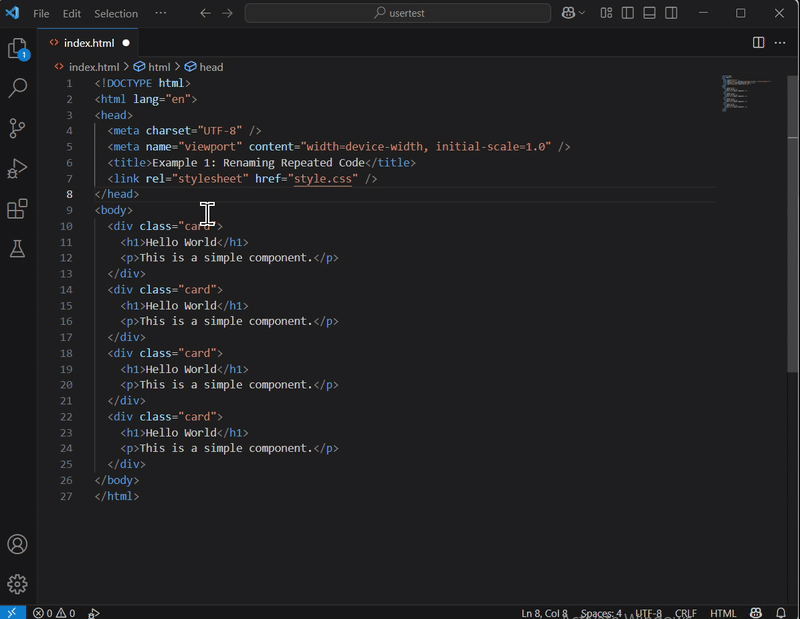
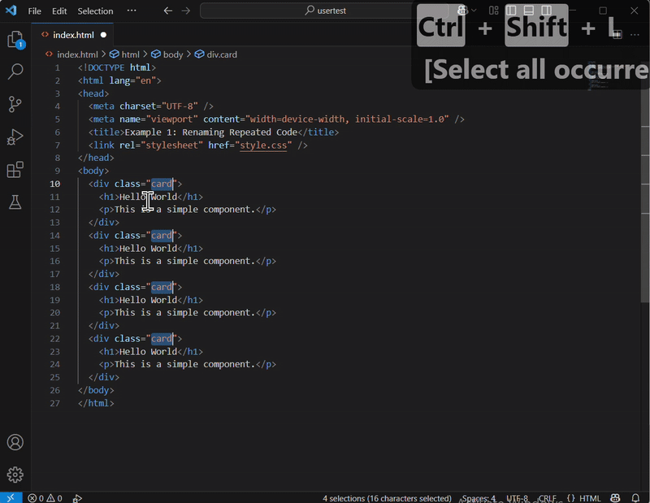
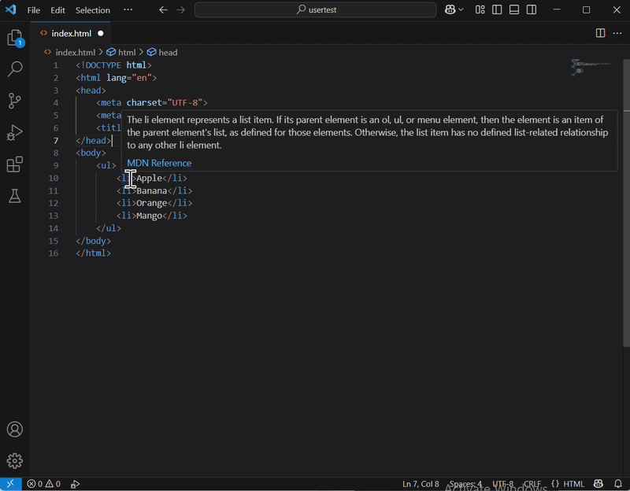
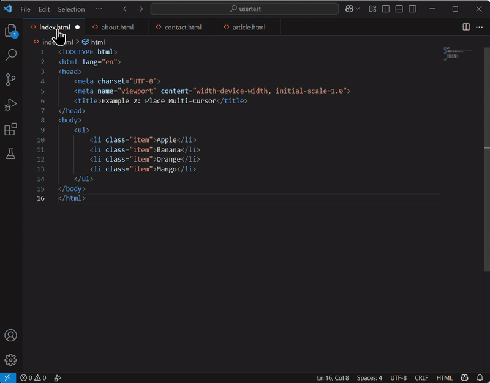
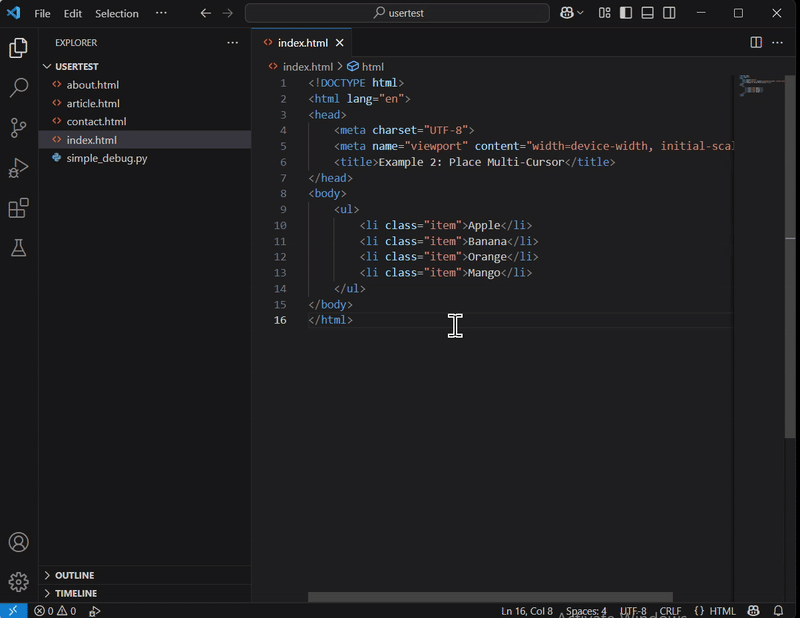

# Editing Code Efficiently in VS Code
## Overview
In this section, we will talk about editing code efficiently in VS Code. This guide shows how to make your HTML editing faster and smarter using features, such as multi-cursor editing, quickly closing multiple tabs, and fast file searching. These tips will help you save time, reduce repetitive work, and focus on more creative and meaningful tasks in your projects.


## Using Multi-Cursor for Faster Code Editing

This set shows how to use the multi-cursor feature in two common scenarios:

- Scenario 1: Renaming Repeated Code <br>Changing a repeated class name across multiple HTML elements.
- Scenario 2: Placing Multi-Cursor <br>Adding an attribute to each list item in a simple HTML list.

### Scenario 1: Renaming Repeated Code
1. <span >**Copy**</span> and <span >**paste**</span> the following HTML structure into a new file:
``` { .html }
<!DOCTYPE html>
<html lang="en">
<head>
  <meta charset="UTF-8" />
  <meta name="viewport" content="width=device-width, initial-scale=1.0" />
  <title>Example 1: Renaming Repeated Code</title>
  <link rel="stylesheet" href="style.css" />
</head>
<body>
  <div class="card">
    <h1>Hello World</h1>
    <p>This is a simple component.</p>
  </div>
  <div class="card">
    <h1>Hello World</h1>
    <p>This is a simple component.</p>
  </div>
  <div class="card">
    <h1>Hello World</h1>
    <p>This is a simple component.</p>
  </div>
  <div class="card">
    <h1>Hello World</h1>
    <p>This is a simple component.</p>
  </div>
</body>
</html>
```
You now have multiple `<div class="card">` elements.
Let's say you want to change the class name `card` to `box`.

2. Select the Text to Edit: <span >**Highlight**</span> one of the word `card`.


    !!! warning
        Ensure that only the intended words are selected to prevent unwanted edits.

3. <span >**Select**</span> More Matches: There are two options to select more matches, depending on your preference.

      - Option 1: Selct One by One <br>While **holding down** `Ctrl`, **press** `D` repeatedly to select the next matching word each time.

      <figure markdown="span">
        { width="100%" }
      </figure>
    
    - Option 2: Select All at Once<br>After selecting one of the words, **press** `Ctrl` + `Shift` + `L` to select all matching words in the file at once

      <figure markdown="span">
        { width="100%" }
      </figure>


4. Edit the Text: Once selected, <span >**type**</span> `box`. Then, all selected words will change at the same time.

      <figure markdown="span">
        { width="100%" }
      </figure>


### Example 2: Place Multi-Cursor
1. <span >**Copy**</span> and <span >**paste**</span> the following HTML structure into a new file:
``` { .html }
<!DOCTYPE html>
<html lang="en">
<head>
    <meta charset="UTF-8">
    <meta name="viewport" content="width=device-width, initial-scale=1.0">
    <title>Example 2: Place Multi-Cursor</title>
</head>
<body>
    <ul>
        <li>Apple</li>
        <li>Banana</li>
        <li>Orange</li>
        <li>Mango</li>
    </ul>
</body>
</html>
```
Now, you want to add `class="item"` to each `<li>` tag.
2. <span >**Click**</span> directly between the `li` and `>` of the first `<li>` tag where you want to insert the attribute.


    !!! warning
        Make sure your cursors are positioned correctly. Incorrect placement may result in malformed HTML.

3. While <span >**holding down**</span> the `Ctrl` + `Alt` keys, <span >**press**</span> the down arrow key (`↓`) repeatedly.
4. <span >**Type**</span>  `class="item"`, then each element will have the class attribute set to `item`.

      <figure markdown="span">
        { width="100%" }
      </figure>


## Quickly Close Multiple Tabs
When you have many open tabs, VS Code gives you easy ways to close tabs without doing it one by one, so you can clean up your editor quickly and get back to coding.

1. <span >**Right-click**</span> on any open tab.
2. <span >**Choose**</span> a Tab Closing Option:
    - `Close`: Closes the current tab.
    - `Close Others`: Closes all tabs except the active one.
    - `Close to the Right`: Closes all tabs to the right of the current tab.
    - `Close to the Left`: Closes all tabs to the left of the current tab.
    - `Close All`: Closes every open tab.
  
    <figure markdown="span">
      { width="100%" }
    </figure>

## Open Files Quickly by Searching
Finding files in large projects can be time-consuming. 
If you can’t remember the exact location, use "Quick Open" to locate your files instantly.

1. <span >**Press**</span> `Ctrl` + `P` to open the "Quick Open" dialog.
2. Search for Your File: <span >**Type**</span> part of the file name. 

    VS Code will display a list of matching files, including those recently or frequently opened.
    
    !!! note
        The more specific you are with the file name, the quicker you’ll find the file you need.

3. Select and Open the File: <span >**Use**</span>  the arrow keys (`↑` / `↓`) to navigate the list, then <span >**press**</span> `Enter` to open the file.

    <figure markdown="span">
      { width="100%" }
    </figure>

!!! success
    Using the "Quick Open" is much faster than browsing through the folder structure manually!

## Conclusion
By the end of this section, you will have successfully learned the following:

:white_check_mark: How to use multi-cursor editing to modify code simultaneously

:white_check_mark: How to quickly manage multiple tabs for a cleaner workspace

:white_check_mark: How to use fast file search to open files efficiently
