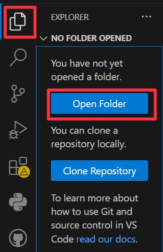
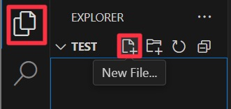
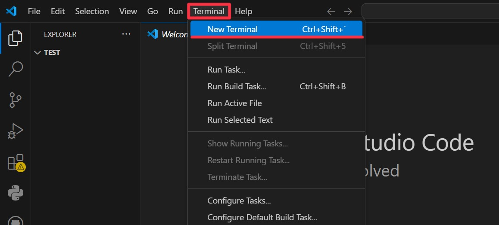
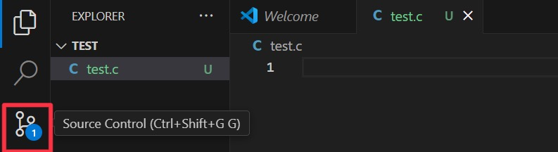
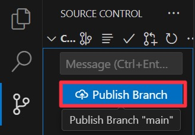
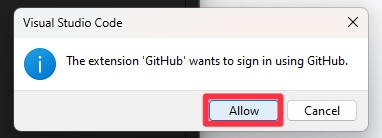
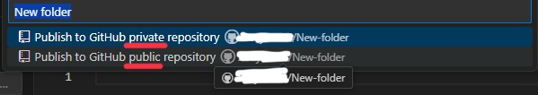
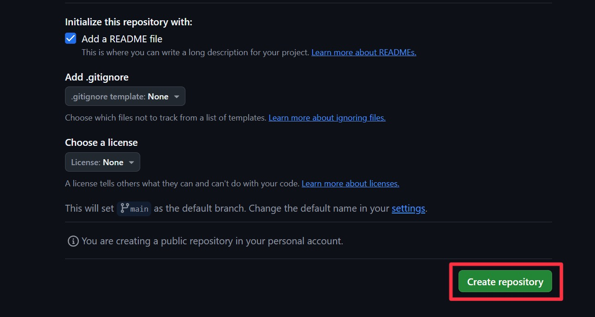
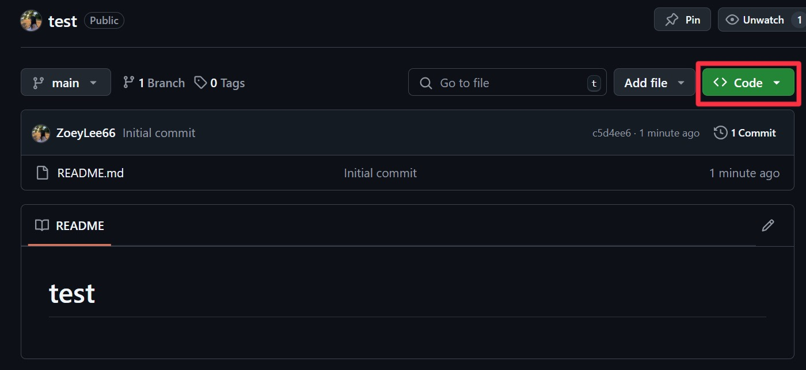
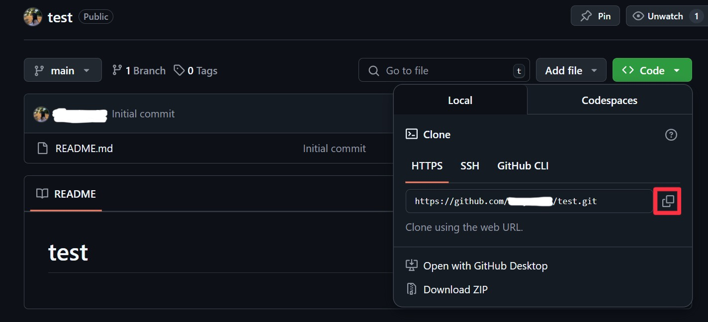

# Connecting to GitHub

## Overview
In this section, you will 

## Option 1: In VS Code
In this section, you know already how to create a new folder
 

## Open a folder and Create a file
1. Click the first icon (Explorer section) in the left navigation, and open a folder you want to save files.

    <figure markdown="span">
      { width="100%" }
    </figure>

2. In the Explorer section, click the one paper icon (New File...) to create a new file.

    <figure markdown="span">
      { width="100%" }
    </figure>
!!! success
    The folder has been opened and the new file has been created.

## Open a new terminal and Type commands
1. In the top navigation, click the terminal option and the new terminal.

    <figure markdown="span">
      { width="100%" }
    </figure> 

2. Type the command below to initialize a local Git repository in the terminal
> git init
!!! success
    The new terminal has been opened and some commands have been written.

## Create a GitHub repository in the VS Code
1. Click the third icon(Source Control) in the left navigation

    <figure markdown="span">
      { width="100%" }
    </figure>
  
2. Click the Publish Branch button

    <figure markdown="span">
      { width="100%" }
    </figure>
    !!! warning
        If you can't find "Publish Branch" button, go to 

3. Click the Allow button, and sign in using GitHub

    <figure markdown="span">
      { width="100%" }
    </figure>

4. Choose whether to make the repository public or private

<figure markdown="span">
  { width="100%" }
</figure>
!!! success
    The new GitHub repository has been created.

 

## Option 2: From GitHub
In this case, we already expected you have GitHub account
 

## Create a new repository in the GitHub
1. Open the GitHub and sign in

    <figure markdown="span">
      { width="100%" }
    </figure>

2. Choose "Your repositories" clicking your profile image and click "New" green button

    <figure markdown="span">
      { width="100%" }
    </figure>

3. Write a new repository name and check the "Add a README file" section

    <figure markdown="span">
      { width="100%" }
    </figure>
    !!! note
        If you want to make the repository private, choose "private" option

4. Click "Create repository" green button in the bottom

    <figure markdown="span">
      { width="100%" }
    </figure>
    !!! success
        The new GitHub repository has been created in the Github.

## Clone the GitHub repository to the VS Code
1. Click "<>Code" green button

    <figure markdown="span">
      { width="100%" }
    </figure>

2. Click the icon highlighted in the red box below to copy the link

    <figure markdown="span">
      { width="100%" }
    </figure>

3. In the VS Code, open a new terminal

    !!! note
        If you don't know how to open a new terminal, click the below sentence.
         
        [Open a new terminal and Type commands](#Open-a-new-terminal-and-Type-commands)
