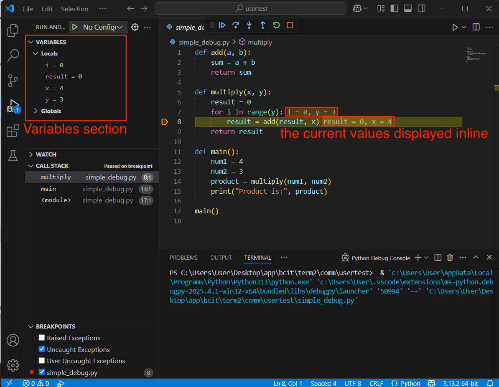
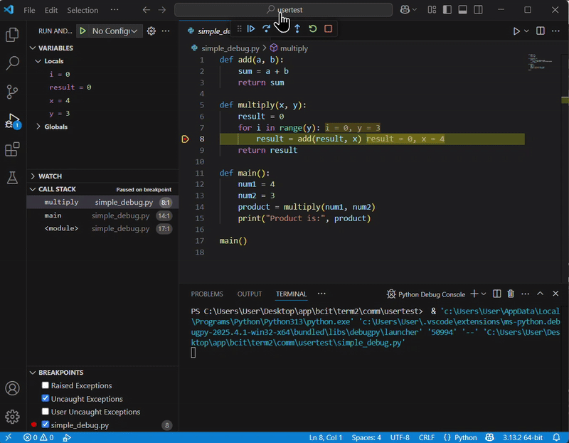
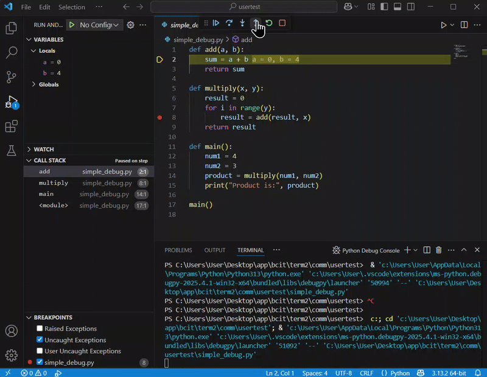
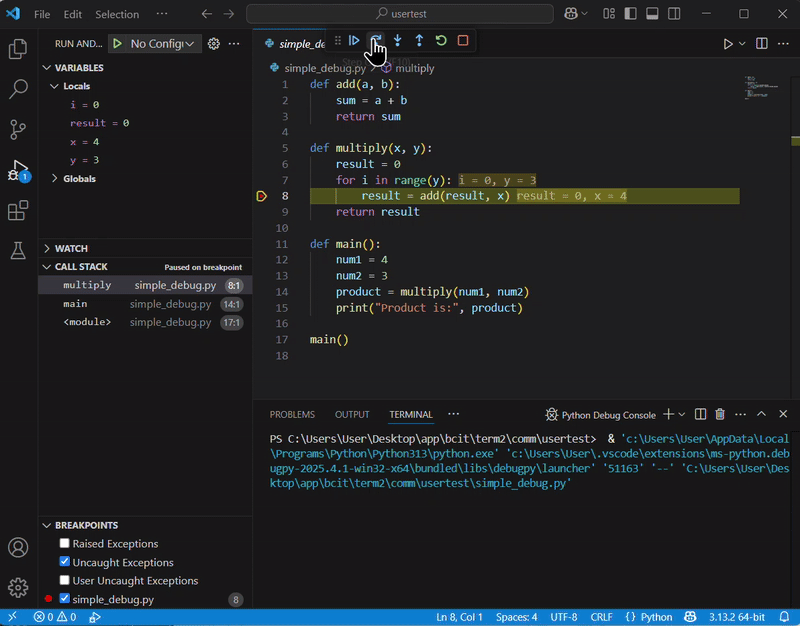
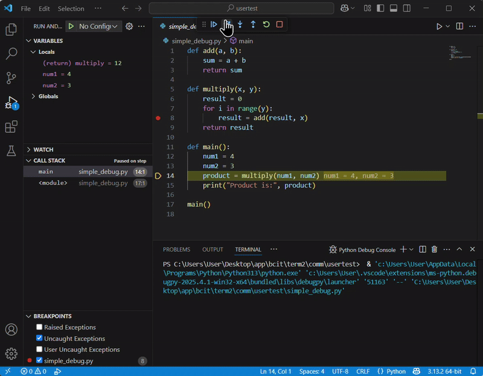

# Debugging in VS Code

## Overview
In this section, we will talk about how to debug your Python code using VS Code. Whether you're a beginner or looking to refine your debugging skills, this guide provides step-by-step instructions on configuring breakpoints, and using debugging features like "Step Into", "Step Over," and "Step Out". By following this guide, you’ll learn how to inspect variables, understand function internals, and troubleshoot your code effectively.

## Enter the Code Example

1. <span >**Copy**</span> and <span >**paste**</span> the following code into a new file:
``` { .py }
def add(a, b):
    sum = a + b
    return sum

def multiply(x, y):
    result = 0
    for i in range(y):
        result = add(result, x)
    return result

def main():
    num1 = 4
    num2 = 3
    product = multiply(num1, num2)
    print("Product is:", product)

main()
```

    !!! Note
        This code defines three functions:

          - `add()`: Adds two numbers.
          - `multiply()`: Uses repeated addition to multiply two numbers.
          - `main()`: Calls `multiply()` and prints the result.

## Open the Debug panel

1. <span >**Click**</span> the "Run and Debug" icon (the bug icon) on the left sidebar.

    !!! shortcut
        Alternatively, press `Ctrl` + `Shift` + `D`. 

<figure markdown="span">
  { width="100%" }
</figure>


## Set Breakpoints
We will set a breakpoint at the line `result = add(result, x)` inside the `multiply()` function to see when the `add()` function is called.

1. <span >**Move**</span> your mouse over the left side of the line numbers. You’ll see a dim red dot appear. 
2. <span >**Click**</span> the dim red dot to set a breakpoint (it turns into a solid red dot).

!!! note
    Breakpoints allow you to pause your program at specific lines to see what is happening.


<figure markdown="span">
  { width="100%" }
</figure>


## Start Debugging
1. <span >**Click**</span> the "Run and Debug" button at the top of the Debug panel. Your code will run and pause at the breakpoint.

<figure markdown="span">
  { width="100%" }
</figure>


## Inspect Variables
1. There are two options to <span >**inspect**</span> variables. 

    - Option 1: Variables section<br>When the code pauses at a breakpoint, you can see the current values of your variables in the Variables section on the left side of the Debug panel. 
    - Option 2: Inline code<br>You can also see the current values for variables (like `i` and `y`) displayed inline in the code, making it easy to track them as you step through.

    !!! note
        Keeping an eye on variables helps you quickly identify where issues may occur in your code.

    <figure markdown="span">
      { width="100%" }
    </figure>


## Step Into: See Inside a Function
1. <span >**Click**</span> the "Step Into" button (down arrow icon) when you reach the line `result = add(result, x)` in the `multiply()` function.

      VS Code will take you inside the `add()` function. 

<figure markdown="span">
  { width="100%" }
</figure>

  Now you can see how the values `a` and `b` are added together.

!!! note
      Use the "Step Into" to understand how each function works.
  


## Step Out: Exit the Current Function
1.  <span >**Click**</span> the "Step Out" button (up arrow icon) if you are inside a function (like `add()`) and want to return to the function that called it. 

    The "Step Out" will finish the current function and take you back to the previous level in your code.
<figure markdown="span">
  { width="100%" }
</figure>

!!! note
      Use the "Step Out" when you have finished inspecting a function’s internal behavior and want to resume higher-level execution.


## Step Over: Skip the Function Details
1. <span >**Click**</span> the "Step Over" button (curved arrow icon) to quickly move to the next line,
rather than watching the details inside the `add()` function. 

    The "Step Over" will execute the `add()` function but not show its inner workings.


<figure markdown="span">
  { width="100%" }
</figure>


!!! Warning
      The "Step Over" won’t let you see their internal operations. Use the "Step Over" when you’re confident that the function is working as expected, or when you need to move quickly through your code.


## Finish Debugging
1. <span >**Click**</span> the stop button (red square) to stop debugging.
2. <span >**Check**</span> your terminal to see the output (it should display `Product is: 12`).

<figure markdown="span">
  { width="100%" }
</figure>


!!! success
    Debugging is complete. If the output is as expected, your code is functioning correctly!

## Conclusion
By the end of this section, you will have successfully learned the following:

:white_check_mark: How to set up, run, and inspect your Python code using the VS Code debugger

:white_check_mark: How to use breakpoints and debugging features such as Step Into, Step Over, and Step Out

:white_check_mark: How to effectively troubleshoot and refine your code during debugging