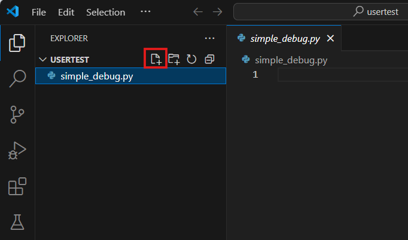
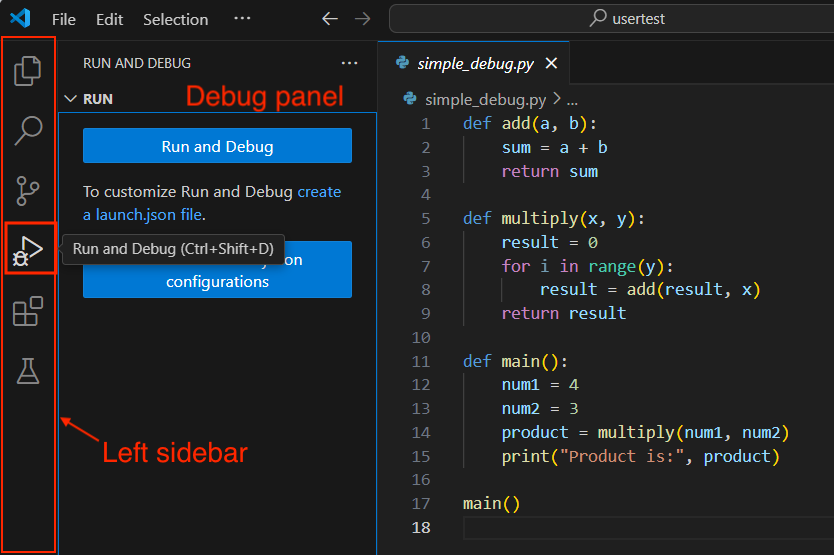
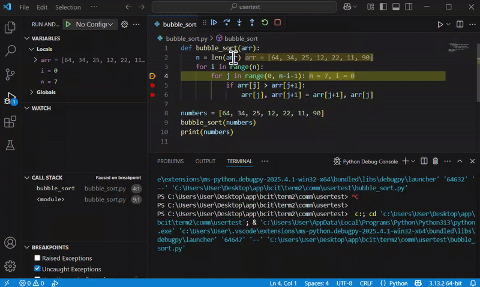
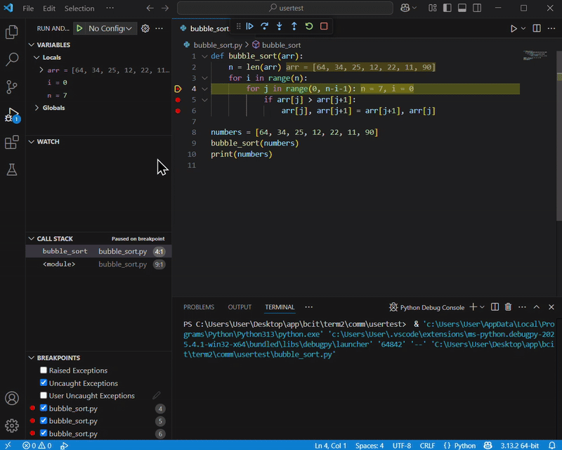

# Debugging in VS Code
In this section, we will talk about Debugging. 
This guide clearly shows how to debug a popular algorithm, Bubble Sort, in Python using VS Code. 
This guide will helps you understand VS Code debugging features, such as **breakpoints**, **Step Into**, **Step Over**, and **Step Out**, while also learning how the Bubble Sort algorithm works.

## 1, Create Your Python File
In VS Code, open a folder and create a Python file named bubble_sort.py.
<figure markdown="span">
  { width="300" }
</figure>


## 2. Enter the Bubble Sort Code
Type or copy the following Python code into your file:
``` { .py }
def bubble_sort(arr):
    n = len(arr)
    for i in range(n):
        for j in range(0, n-i-1):
            if arr[j] > arr[j+1]:
                arr[j], arr[j+1] = arr[j+1], arr[j]

numbers = [64, 34, 25, 12, 22, 11, 90]
bubble_sort(numbers)
print(numbers) 
```

## 3. Open the Debug panel
Click the **Run and Debug (Ctrl_Shift_D)** icon (bug icon) in the VS Code left sidebar.
<figure markdown="span">
  { width="300" }
</figure>


## 4. Set Breakpoints
Breakpoints allow your code to pause at specific lines, helping you closely inspect what happens during each step.

To set breakpoints:

- Move your mouse cursor to the left margin area next to the line numbers.
- You'll notice a dim red dot appear when hovering. Click the grey dot, turning it into a solid red dot. This red dot means a breakpoint is now set.

<figure markdown="span">
  { width="300" }
</figure>


``` { .py .annotate }
def bubble_sort(arr):
    n = len(arr)
    for i in range(n):  # (1)
        for j in range(0, n-i-1):  # (2)
            if arr[j] > arr[j+1]:  # (3)
                arr[j], arr[j+1] = arr[j+1], arr[j]

numbers = [64, 34, 25, 12, 22, 11, 90]
bubble_sort(numbers)
print(numbers) 
```

1. Line `4` (outer loop) - To observe iterations over the entire list.
2. Line `5` (inner loop) - To watch the pairwise comparison of elements.
3. Line `6` (swap operation) - To see exactly when elements get swapped.

Click next to line numbers to set breakpoints:

- Line `4` (outer loop)
- Line `5` (inner loop)
- Line `6` (swap operation)

## 5. Start Debugging
Click the "Run and Debug" button at the top of the Debug panel to run your code until it pauses at the first breakpoint.
<figure markdown="span">
  { width="300" }
</figure>


## 6. Inspect Variables
At your first breakpoint (line 4), hover your mouse over variables like `arr`, `i`, and `j` to view their values.
<figure markdown="span">
  { width="300" }
</figure>


## 7: Step Over: Step through outer loop
Before stepping through the code:

- Open the WATCH panel on the left side of the debug panel.
- Click the ➕ icon in the WATCH section and type in `arr[j]` and `arr[j+1]`. Their current values will be displayed and updated live.
<figure markdown="span">
  { width="300" }
</figure>

Now use the "Step Over" button (↪️ curved arrow icon at the top Debug toolbar) to run your current line and move to the next line without entering deeper into functions or loops.

- Watch closely how j changes with each step.
- As you step over, look at the `arr[j]` and `arr[j+1]` values in the WATCH panel to see exactly which elements are being compared.
- You'll see the largest number move to the right with each pass.

<figure markdown="span">
  { width="300" }
</figure>


## 8: Step Into: Step through inner loop
You can use Step Into when you want to go into funciton and how the inner? function works. 

To see when to use step into , and see how different step into is compared to step over,
Type or copy the following Python code into your file:

``` { .py }
def compare_and_swap(arr, j):
    if arr[j] > arr[j+1]:
        arr[j], arr[j+1] = arr[j+1], arr[j]

def bubble_sort(arr):
    n = len(arr)
    for i in range(n):
        for j in range(0, n-i-1):
            compare_and_swap(arr, j)

numbers = [64, 34, 25, 12, 22, 11, 90]
bubble_sort(numbers)
print(numbers) 
```

Use the "Step Into" button (⬇️ down arrow icon at the top Debug toolbar)  
to go inside the `compare_and_swap()` function and see exactly how the comparison and swapping works.

For example, when your breakpoint is at the line `compare_and_swap(arr, j)`,  
click "Step Into" to enter the function. You'll be taken to the line `if arr[j] > arr[j+1]:`.

Inside the function:
- Hover over `arr`, `j`, and use the **WATCH** panel to track `arr[j]` and `arr[j+1]`.
- Step through each line inside `compare_and_swap()` to observe when and how the swap happens.


## 9: Watch Swapping Elements
When stopped at line 6, carefully check how two elements are swapped:

- Confirm by hovering over elements that the left one is larger than the right one.
- Use the "Step Over" button (↪️) to perform the swap, and hover again to see the updated array.

# 10. Step Out
- Use the "Step Out" button (⬆️ up arrow icon at the top Debug toolbar) to quickly finish the current loop or function call and return to the outer loop.
- Continue using the "Step Over" button to see outer loop progress.

# 11. Finish and Review
- Finally, click the red square button (🟥) to stop debugging. 
- Check the terminal output; your numbers should be sorted.

You've successfully debugged and understood Bubble Sort using VS Code!

