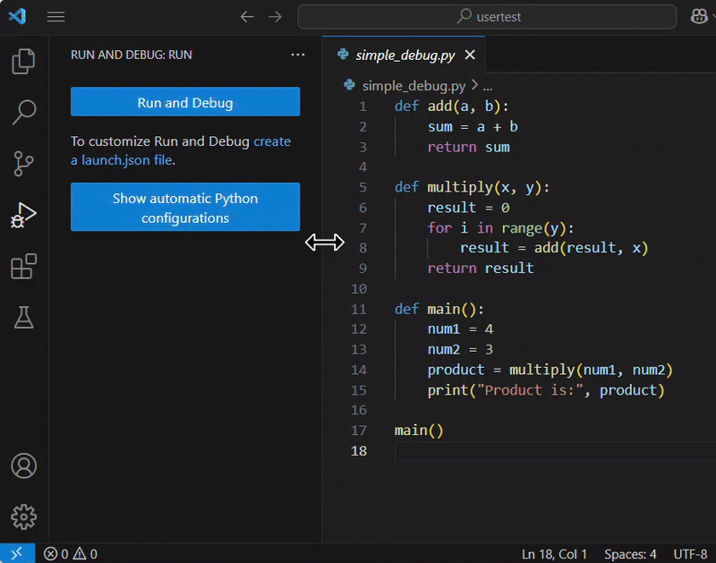
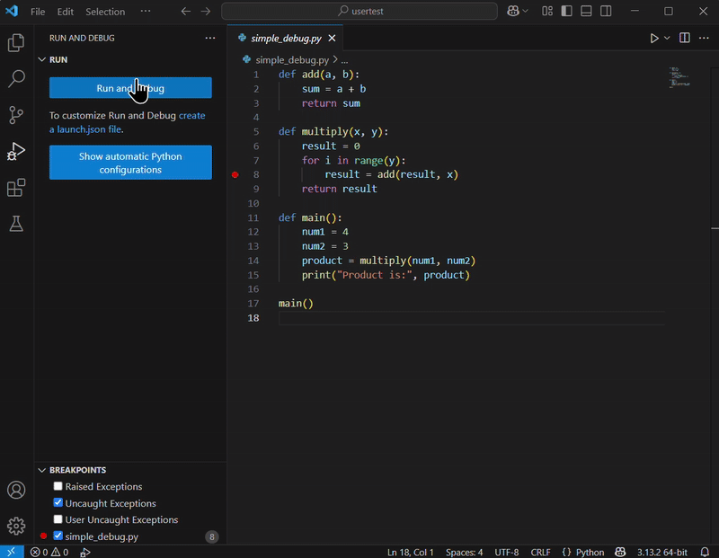

# Debugging in VS Code

## Overview
In this section, we will talk about how to debug your Python code using VS Code. Whether you are a beginner or looking to refine your debugging skills, this guide provides step-by-step instructions on configuring breakpoints, and using debugging features like "Step Into", "Step Over," and "Step Out". By following this guide, you’ll learn how to inspect variables, understand function internals, and troubleshoot your code effectively.

!!! notes
    As it's listed as a prerequisite, we’ve intentionally left out Python debugger configuration to focus solely on functional debugging. If you’re unfamiliar with setting up the debugger, we recommend reviewing the official VS Code documentation before proceeding.


## Enter the Code Example

1. <span >**Copy**</span> and <span >**paste**</span> the following code into a new file:
``` { .py }
def add(a, b):
    sum = a + b
    return sum

def multiply(x, y):
    result = 0
    for i in range(y):
        result = add(result, x)
    return result

def main():
    num1 = 4
    num2 = 3
    product = multiply(num1, num2)
    print("Product is:", product)

main()
```

    !!! Note
        This code defines three functions:

          - `add()`: Adds two numbers.
          - `multiply()`: Uses repeated addition to multiply two numbers.
          - `main()`: Calls `multiply()` and prints the result.

## Open the Debug panel

1. <span >**Click**</span> the "Run and Debug" icon (the bug icon) on the left sidebar.

    !!! shortcut
        Alternatively, press `Ctrl` + `Shift` + `D`. 

<figure markdown="span">
  { width="100%" }
</figure>


## Set Breakpoints
We will set a breakpoint at the line `result = add(result, x)` inside the `multiply()` function to see when the `add()` function is called.

1. <span >**Move**</span> your mouse over the left side of the line numbers. <br>You’ll see a dim red dot appear. 
2. <span >**Click**</span> the dim red dot to set a breakpoint (it turns into a solid red dot).

!!! note
    Breakpoints allow you to pause your program at specific lines to see what is happening.


<figure markdown="span">
  { width="100%" }
</figure>


## Start Debugging
1. <span >**Click**</span> the "Run and Debug" button at the top of the Debug panel. <br>Your code will run and pause at the breakpoint.

<figure markdown="span">
  { width="100%" }
</figure>


## Inspect Variables

Inspecting variables helps you quickly identify where issues may occur in your code.

1. There are two options to <span >**inspect**</span> variables. 

    - Option 1: Variables section<br>When the code pauses at a breakpoint, you can see the current values of your variables in the Variables section on the left side of the Debug panel. 
    - Option 2: Inline code<br>You can also see the current values for variables (like `i` and `y`) displayed inline in the code, making it easy to track them as you step through.

    <figure markdown="span">
      { width="100%" }
    </figure>


## Step Into: See Inside a Function

Use the "Step Into" to understand how each function works.

1. <span >**Click**</span> the "Step Into" button (down arrow icon) when you reach the line `result = add(result, x)` in the `multiply()` function.

      VS Code will take you inside the `add()` function. 

2. When you’re inside `add()`, **click** "Step Into" again to move to the next line.

    Since the function is short, it may return quickly and take you back to the `multiply()` function right away.

!!! notes
     Once the inner function finishes, you will be taken back to the point where it was called.
<figure markdown="span">
  { width="100%" }
</figure>

  Now you can see how the values `a` and `b` are added together.


## Step Out: Exit the Current Function

Use the "Step Out" when you have finished inspecting a function’s internal behavior and want to resume higher-level execution.

1.  <span >**Click**</span> the "Step Out" button (up arrow icon) if you are inside a function (like `add()`) and want to return to the function that called it. 

    The "Step Out" will finish the current function and take you back to the previous level in your code.

2. **Click** "Step Out" again after returning to the calling function.

    The debugger will continue running until the current function finishes or it hits another breakpoint.

!!! notes
    If there are no more breakpoints, the program may run to the end and exit.
<figure markdown="span">
  { width="100%" }
</figure>


## Step Over: Skip the Function Details

Use the "Step Over" when you want to focus on the current function and skip over lower-level details.

1. <span >**Click**</span> the "Step Over" button (curved arrow icon) to quickly move to the next line,
rather than watching the details inside the `add()` function. 

    The "Step Over" will execute the `add()` function but not show its inner workings.

2. **Click** "Step Over" again.
    
    The debugger will continue to the next line in the current function, executing one line at a time.

<figure markdown="span">
  { width="100%" }
</figure>


!!! Warning
      The "Step Over" won’t let you see a function’s internal operations. Use it when you’re confident that the function works as expected, or when you want to move through your code efficiently.


## Finish Debugging

If your program finishes running during debugging, you’ll see the final output (`Product is: 12`) in the terminal.

However, if you’ve already found what you were looking for before the program ends, you can terminate the session at any time.

1. <span >**Click**</span> the stop button (red square) to end the debugging session.

    The session will end immediately without executing the remaining code, and you will not see the final output.

<figure markdown="span">
  { width="100%" }
</figure>


!!! success
    Debugging is complete. If you saw the expected output, your code is functioning correctly.  
    If you stopped early, but confirmed the behavior you were checking, then your debugging was also successful!

## Conclusion
By the end of this section, you will have successfully learned the following:

- [x] How to set up, run, and inspect your Python code using the VS Code debugger 
- [x] How to use breakpoints and debugging features such as Step Into, Step Over, and Step Out
- [x] How to effectively troubleshoot and refine your code during debugging